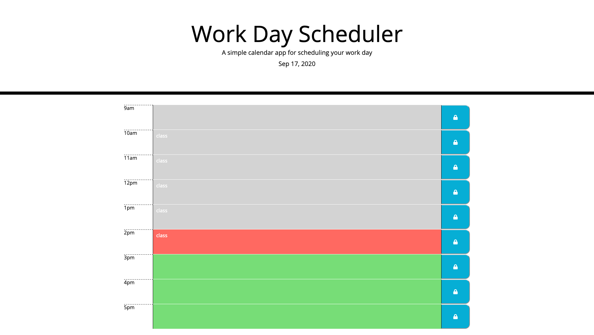

# daily-planner

A simple, mobile responsive app webpage for planning your work day.

## Despriction

The page seperates the day into hour blocks for the hours 9am to 5pm. In each block you can write down what you are doing during that time period. The page uses local storage to ensure the entries stay during page reloads and the blocks change color based on what time it is. Future blocks are in green, the current block is in red and past blocks are in gray. 

## Preview of Page

## Live Page
<https://mercspring.github.io/daily-planner/>